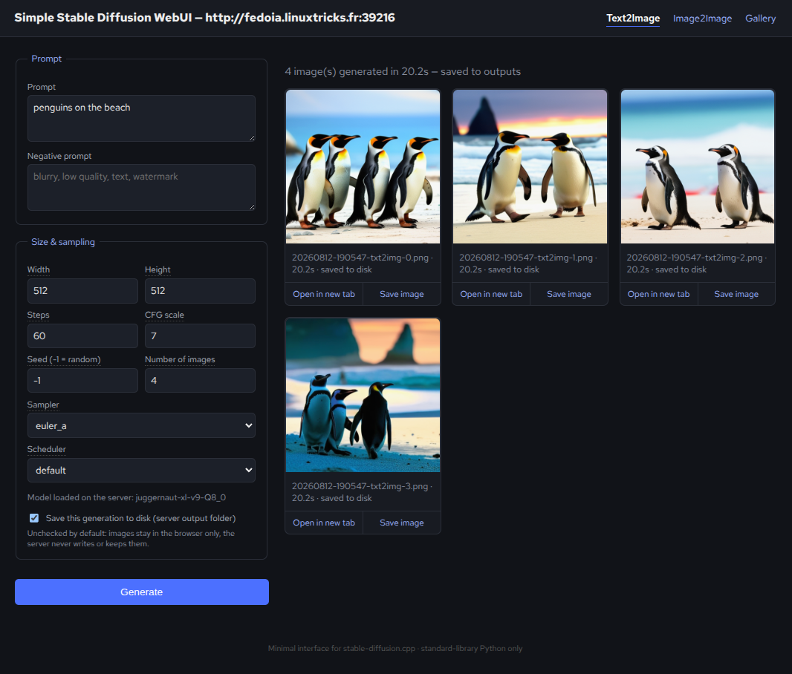

# Simple Stable Diffusion WebUI (ssd_webui)

**Read this in other languages:**

[English 🇺🇸](https://github.com/aaaaadrien/Simple-StableDiffusion-WebUI/blob/main/README.md) - [Français 🇫🇷](https://github.com/aaaaadrien/Simple-StableDiffusion-WebUI/blob/main/README.fr.md)

---

Une interface web minimale pour piloter un serveur
[stable-diffusion.cpp](https://github.com/leejet/stable-diffusion.cpp)
(mode `sd-server`). Script Python en un seul fichier, **zéro dépendance
externe** (bibliothèque standard uniquement, Python 3.9+), toute la
configuration se fait via des options en ligne de commande.

L'application communique avec le serveur sd.cpp via son API compatible
(`/sdapi/v1/txt2img` et `/sdapi/v1/img2img`).

## Screenshot 



## Fonctionnalités

- Onglet **Text2Image** : génération classique prompt vers image (taille, steps,
  CFG scale, seed, batch size, sampler, scheduler).
- Onglet **Image2Image** : dépose/glisse une image source et éditez-la avec un
  jeu de paramètres dédié (denoising strength + les contrôles habituels
  d'échantillonnage).
- Onglet **Gallery** : parcourt les images explicitement enregistrées sur le
  disque.
- Liens **"Open in new tab"** et **"Save image"** sur chaque vignette
  générée.
- **Confidentialité par défaut** : les images générées sont renvoyées au
  navigateur uniquement (sous forme de data-URL en base64) et ne sont
  **jamais écrites sur le disque du serveur**, sauf si on coche
  explicitement "Save this generation to disk" pour cette génération
  précise. Une option d'administration (`--disable-save`) permet de
  supprimer complètement cette possibilité pour toute l'instance.
- Pas de base de données, pas d'étape de build, pas de framework : un seul
  fichier `.py` lisible de bout en bout.

## Prérequis

- Python 3.9 ou plus récent (bibliothèque standard uniquement, rien à
  installer via `pip`).
- Un serveur `stable-diffusion.cpp` en cours d'exécution, démarré avec
  mode `sd-server` / HTTP activé et joignable en HTTP.

## Démarrage rapide

1. Démarrer l'interface web en la pointant vers ce serveur :

   ```bash
   python3 ssd_webui.py --sd-url http://127.0.0.1:8082 --port 8083 --open-browser
   ```

2. Ouvrir `http://127.0.0.1:8083` dans le navigateur (il s'ouvre
   automatiquement avec `--open-browser`) :
   - **Text2Image** : écrire un prompt, ajuster les paramètres, cliquer sur
     *Generate*.
   - **Image2Image** : déposer une image source, écrire un prompt, ajuster la
     denoising strength, cliquer sur *Generate*.
   - **Gallery** : afficher tout ce qui a été explicitement enregistré sur le
     disque.

## Options en ligne de commande

| Option           | Défaut                    | Description                                                                 |
| ------------------ | --------------------------- | ------------------------------------------------------------------------------- |
| `--sd-url`         | `http://127.0.0.1:8082`   | URL de base du serveur stable-diffusion.cpp                                    |
| `--host`           | `127.0.0.1`                | Adresse d'écoute de l'interface web                                            |
| `--port`           | `8083`                     | Port d'écoute de l'interface web                                               |
| `--output-dir`     | `./outputs`                 | Dossier utilisé pour enregistrer les images générées (seulement si demandé)    |
| `--timeout`        | `300`                       | Timeout en secondes pour les appels au serveur sd.cpp                          |
| `--open-browser`   | désactivé                   | Ouvre automatiquement le navigateur par défaut au démarrage                    |
| `--disable-save`   | désactivé                   | Interdit toute écriture d'image sur le disque (masque la case à cocher, désactive la galerie et `/files`) |

Lance `python3 ssd_webui.py --help` à tout moment pour la liste complète.

### Exemple : déploiement strict « sans persistance »

```bash
python3 ssd_webui.py --sd-url http://127.0.0.1:8082 --host 0.0.0.0 --port 8083 --disable-save
```

Dans ce mode, la case « save » et l'onglet Gallery disparaissent, et aucune
image générée ne peut jamais être écrite sur le système de fichiers du
serveur, tout reste transitoire, dans la réponse HTTP envoyée au
navigateur. (utile pour tourner sur un serveur ou service systemd)

## Lancer en tant que service systemd

Un exemple de fichier unit, `ssd_webui.service`, est fourni pour exécuter SSD
WebUI en arrière-plan (écoute sur le port **8083** dans l'exemple), avec
démarrage automatique au boot et redémarrage automatique en cas de plantage.

1. Créer un utilisateur système dédié et installer l'application :

   ```bash
   sudo useradd --system --no-create-home --shell /usr/sbin/nologin ssd-webui
   sudo mkdir -p /opt/ssd-webui/outputs
   sudo cp ssd_webui.py /opt/ssd-webui/
   sudo chown -R ssd-webui:ssd-webui /opt/ssd-webui
   ```

2. Copier le fichier unit et ajuster à la configuration :

   ```bash
   sudo cp ssd_webui.service /etc/systemd/system/ssd_webui.service
   sudo systemctl daemon-reload
   ```

3. Activer et démarre le service :

   ```bash
   sudo systemctl enable --now ssd_webui.service
   ```

4. Vérifier le statut et les logs :

   ```bash
   sudo systemctl status ssd_webui.service
   sudo journalctl -u ssd_webui.service -f
   ```

Par défaut dans l'exemple, le service écoute sur `127.0.0.1:8083` en http. Placer un
reverse proxy (nginx/Caddy) avec TLS et authentification devant si tu dois
l'exposer au-delà de localhost, car SSD WebUI n'a lui-même aucune
authentification intégrée. 

Pour arrêter ou redémarrer le service :

```bash
sudo systemctl stop ssd_webui.service
sudo systemctl restart ssd_webui.service
```
